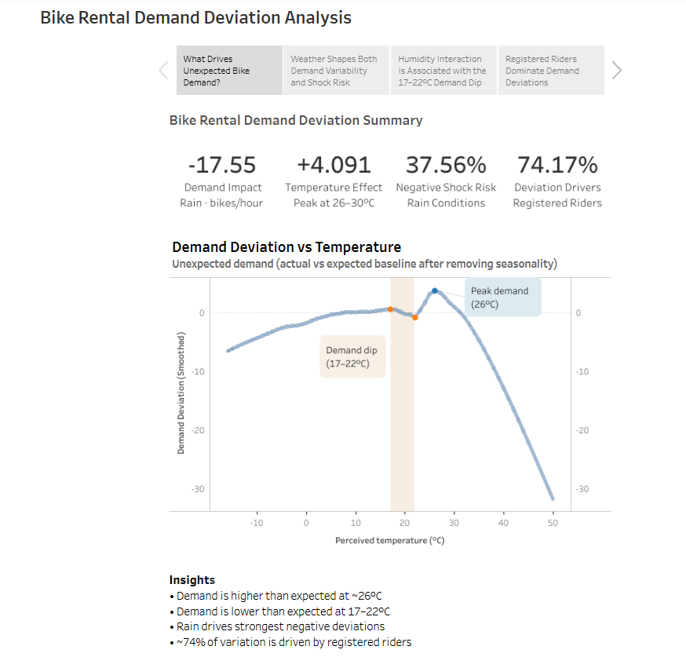

# Bike-Sharing Demand Deviation Analysis

Analyzing bike-sharing demand deviations using time series decomposition (STL) to uncover how weather, temperature, humidity, and rider behavior influence demand beyond seasonal patterns.

🔗 **Tableau Dashboard:**  

---

## Project Overview

This project focuses on understanding **unexpected changes in bike demand** after removing trend and seasonality.  
By analyzing **residual demand**, we isolate how external factors drive deviations from expected usage.

---

## Key Insights

- Rain is associated with **~17–18 fewer rentals/hour** and a sharp increase in negative demand shocks (6% → 38%)
- Demand peaks around **26°C**, but shows a **non-monotonic dip at 17–22°C**
- This dip is associated with **high humidity**, not temperature alone
- ~**80% of demand deviations during extreme shocks** is driven by **registered (commuter) riders**

---

## 📊 Methodology

- **Time Series Decomposition**
  - STL used to remove trend and weekly seasonality
  - Residuals interpreted as demand deviations

- **Statistical Analysis**
  - Non-parametric tests (Kruskal-Wallis, etc.)
  - Shock probability analysis (top/bottom 10%)

- **Behavioral Segmentation**
  - Separate decomposition for casual vs registered riders

- **Interaction Analysis**
  - LOWESS smoothing to explore nonlinear relationships
  - Focus on temperature × humidity effects

---

## 📈 Key Findings

### 1. Weather Effects
- Adverse weather strongly suppresses demand deviations
- Favorable weather increases likelihood of demand surges rather than average demand

### 2. Temperature Effects
- Demand follows a nonlinear pattern with peak around **26°C**
- A transition zone (**17–22°C**) shows unexpected negative deviations

### 3. Rider Behavior
- Demand shocks are primarily driven by **registered riders**
- Indicates commuter behavior dominates system variability

### 4. Temperature–Humidity Interaction
- The 17–22°C dip coincides with **peak humidity levels**
- Under low humidity, demand follows expected increasing trend
- Under high humidity, demand is consistently suppressed

---

## Operational Implications

- Reduce bike allocation during rainy conditions (~15–20 fewer rentals/hour expected)
- Increase capacity during **26–30°C** periods to capture demand spikes
- Monitor high-humidity days (17–22°C) for unexpected demand drops
- Prioritize commuter-heavy areas for redistribution planning

---

## 📚 Data Source

Fanaee-T, H. (2013). *Bike Sharing* [Dataset]. UCI Machine Learning Repository.  
https://doi.org/10.24432/C5W894
