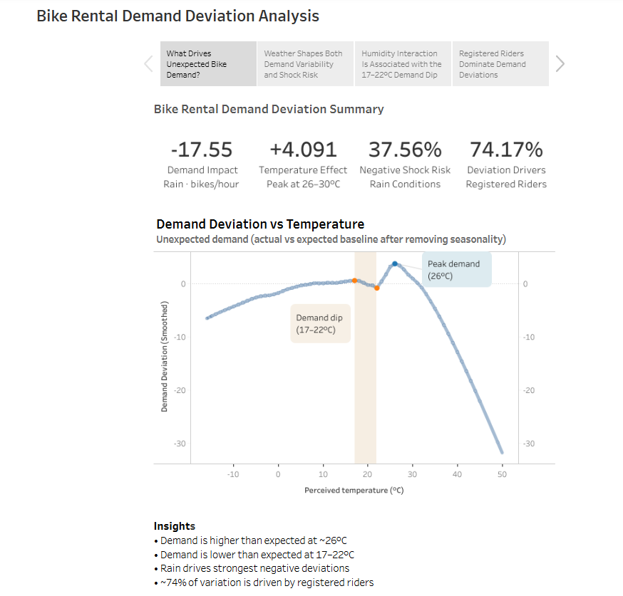

# Bike-Sharing Demand Deviation Analysis for Operational Planning

## Project Overview

This project analyzes bike-sharing demand deviations using time-series decomposition (STL) to understand how weather, temperature, humidity, and rider behavior influence demand beyond seasonal patterns. By isolating **residual demand**, we translate these patterns into **actionable strategies for bike allocation, capacity planning, and operations**.

**Tableau Dashboard:**  

---

## Operational Takeaways
- **Adjust supply based on weather**: Reduce bike allocation by ~15–20 bikes/hour during rain and increase availability under clear conditions to capture demand spikes.
- **Plan capacity around temperature**: Maintain higher bike availability in warm conditions (22–30°C, peak around 26°C) and reduce supply during extreme cold or heat when demand drops.
- **Avoid overestimating demand in moderate temperatures (17–22°C)**: Treat this range as a risk zone with higher likelihood of demand drops, especially under high humidity.
- **Incorporate humidity as a demand signal**: High humidity suppresses demand even at moderate temperatures; adjust allocation downward when humidity is elevated.
- **Prioritize commuter-driven demand**: Registered riders account for ~80% of extreme demand fluctuations, so bike allocation should focus on peak commuting periods and locations.

---

## Key Results

- Rain is associated with **~17–18 fewer rentals/hour** and a sharp increase in negative demand shocks (6% → 38%)
- Demand peaks around **26°C**, but shows a **non-monotonic dip at 17–22°C**
- This dip is associated with **high humidity**, not temperature alone
- ~**80% of demand deviations during extreme shocks** is driven by **registered (commuter) riders**

---

## Methodology

- **Time Series Decomposition**
  - STL used to remove trend and weekly seasonality
  - Residuals interpreted as demand deviations

- **Statistical Analysis**
  - Non-parametric tests (Kruskal-Wallis, etc.)
  - Shock probability analysis (top/bottom 10%)

- **Behavioral Segmentation**
  - Separate decomposition for casual vs registered riders

- **Interaction Analysis**
  - LOWESS smoothing to explore nonlinear relationships
  - Focus on temperature × humidity effects

---

## Detailed Findings

### 1. Weather Effects
- Adverse weather strongly suppresses demand deviations
- Favorable weather increases likelihood of demand surges rather than average demand

### 2. Temperature Effects
- Demand follows a nonlinear pattern with peak around **26°C**
- A transition zone (**17–22°C**) shows unexpected negative deviations

### 3. Rider Behavior
- Demand shocks are primarily driven by **registered riders**
- Indicates commuter behavior dominates system variability

### 4. Temperature–Humidity Interaction
- The 17–22°C dip coincides with **peak humidity levels**
- Under low humidity, demand follows expected increasing trend
- Under high humidity, demand is consistently suppressed

---

## Data Source

Fanaee-T, H. (2013). *Bike Sharing* [Dataset]. UCI Machine Learning Repository.  
https://doi.org/10.24432/C5W894
